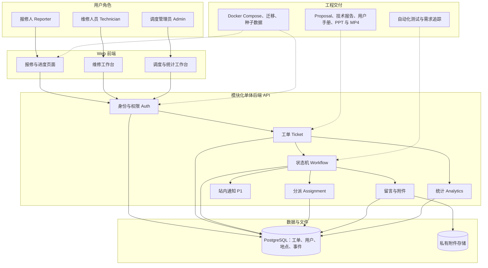

# CampusFix 产品需求文档

版本：0.1（供团队讨论与导师确认）  
项目类型：JC2001 软件工程导论小组项目的 Web Proof of Concept（PoC）  
文档定位：产品目标、范围、工程设计与验收基线；不是最终技术报告  
依据：JC2001 2026–27 Group Project Description and Submission Requirements

## 1. 项目摘要

CampusFix 是一个校园设施报修与工单管理系统。报修人通过 Web 页面提交设施问题，调度管理员审核并分派，维修人员记录处理过程，报修人确认结果。系统保留完整时间线，使每张工单的责任、状态和处理结果可追溯。

项目成功的定义不是实现尽可能多的功能，而是交付一套能在新环境中运行、能演示完整业务闭环、权限正确、数据一致、测试结果可复现的 PoC。该 PoC 不代表学校真实维修服务，不使用真实学生或员工数据，也不承诺正式上线。

### 1.1 待解决的问题

- 报修入口分散，问题描述和位置不统一，容易遗漏信息。
- 报修人无法持续查看进度，重复询问增加沟通成本。
- 管理员难以判断待处理、超期和重复问题。
- 维修人员缺少集中工作台和标准化的处理记录。
- 事后难以追溯谁在何时审核、分派、维修和确认。

### 1.2 目标与非目标

| 类型 | 内容 |
| --- | --- |
| 目标 O1 | 完成“提交—审核—分派—处理—确认—关闭”的工单闭环。 |
| 目标 O2 | 使三类角色只能查看和操作其授权范围内的数据。 |
| 目标 O3 | 留存附件、留言、状态变化和责任变更记录。 |
| 目标 O4 | 从实际工单数据生成基础统计，支持管理者发现积压和常见问题。 |
| 目标 O5 | 提供可复现的安装、运行、测试和演示流程。 |
| 非目标 | 正式接入学校统一身份认证、支付/采购、复杂排班、IoT、实时聊天、移动原生 App、生产级高可用。 |

### 1.3 成功验收场景

在全新环境按用户手册启动后，使用演示账户完成以下过程：报修人提交含地点和照片的工单；管理员审核、设优先级并分派；维修人员开始处理并提交维修结果；报修人确认或要求返工；所有动作显示在时间线中；仪表盘统计随数据变化；无权用户无法访问或修改该工单。演示流程及自动化测试均通过。

## 2. 用户、角色与业务边界

| 角色 | 主要任务 | 可见范围 |
| --- | --- | --- |
| 报修人 Reporter | 创建报修、补充说明、查看进度、确认或要求返工 | 自己创建的工单 |
| 维修人员 Technician | 查看分配给自己的工单、开始处理、记录结果 | 当前分配给自己的工单 |
| 调度管理员 Admin | 审核、分类、分派、必要时重新分派、维护位置、查看全局统计 | 全部工单和管理数据 |

PoC 采用系统内演示账户。管理员账户由种子数据或受控初始化脚本创建；普通页面不允许用户自行注册管理员。是否开放报修人自助注册由团队在实现前确定，演示时至少提供三类固定账户。

业务边界为校园内设施问题，例如照明、桌椅、门窗、空调和卫生设施。紧急安全事故、医疗事件和报警不由本系统处置；页面应提示用户使用学校既有紧急渠道。

## 3. 范围和优先级

### 3.1 P0：PoC 必须完成

1. 登录、退出与服务端角色授权。
2. 校园楼宇、楼层和房间/区域的受控选择。
3. 报修单创建、图片上传、列表、筛选和详情。
4. 管理员审核、驳回、分类、优先级设置和分派。
5. 维修人员开始处理、提交维修记录和结果照片。
6. 报修人确认完成或要求返工。
7. 工单事件时间线、公开留言和基础统计。
8. 数据库迁移、演示数据、自动化测试、可运行交付包和用户手册。

### 3.2 P1：核心闭环稳定后再做

- 站内通知和未读提醒。
- 管理员重新分派。
- 相同地点、相近类别的疑似重复报修提示。
- 统计数据 CSV 导出。
- 维修结果满意度评价。

### 3.3 不纳入本轮

自动派单优化、地图导航、外部邮件或短信网关、学校真实用户目录、供应商结算、复杂 SLA、原生移动端和生成式 AI 诊断。新增功能必须先评估是否影响 P0 测试与文档一致性，并与导师讨论重大范围变更。

## 4. 业务规则与状态机

### 4.1 工单状态

| 状态 | 含义 | 正常进入条件 |
| --- | --- | --- |
| SUBMITTED 已提交 | 报修人提交，等待审核 | 表单校验通过 |
| PENDING_ASSIGNMENT 待分派 | 管理员确认是有效报修 | 审核通过 |
| ASSIGNED 已分派 | 已指定维修人员，尚未开始 | 有可用维修人员 |
| IN_PROGRESS 处理中 | 维修人员开始维修或返工 | 当前操作者为被分派人 |
| PENDING_CONFIRMATION 待确认 | 维修人员提交处理结果 | 有处理说明 |
| CLOSED 已关闭 | 报修人确认完成 | 报修人确认 |
| REJECTED 已驳回 | 不属于维修范围或信息无效 | 管理员提供驳回原因 |
| CANCELLED 已撤销 | 报修人不再需要处理 | 仅限审核前撤销 |

返工不是单独的长期状态：待确认的工单经报修人说明原因后回到 IN_PROGRESS，并新增 REWORK_REQUESTED 事件。这样工单状态代表当前责任阶段，事件记录表达历史。

### 4.2 允许的转换

| 当前状态 | 动作 | 操作者 | 下一状态 | 必填数据 |
| --- | --- | --- | --- | --- |
| SUBMITTED | 审核通过 | Admin | PENDING_ASSIGNMENT | 类别、优先级 |
| SUBMITTED | 驳回 | Admin | REJECTED | 驳回原因 |
| SUBMITTED | 撤销 | 原报修人 | CANCELLED | 可选原因 |
| PENDING_ASSIGNMENT | 分派 | Admin | ASSIGNED | 维修人员 |
| ASSIGNED | 开始处理 | 当前维修人员 | IN_PROGRESS | 可选备注 |
| IN_PROGRESS | 提交结果 | 当前维修人员 | PENDING_CONFIRMATION | 处理说明 |
| PENDING_CONFIRMATION | 确认完成 | 原报修人 | CLOSED | 可选评价 |
| PENDING_CONFIRMATION | 要求返工 | 原报修人 | IN_PROGRESS | 返工原因 |

非法状态跳转必须返回明确错误，不能由前端直接改写状态字段。管理员特殊处理若确有需要，应单独设计“管理员关闭”动作、必填原因和事件记录；不在 P0 中静默开放万能修改接口。

### 4.3 其他业务规则

- 一个工单在同一时间最多有一名当前维修人员；重新分派保留原分派历史。
- 优先级由管理员设为低、中、高；PoC 不自动声称“高优先级等于紧急事故处理”。
- 报修人可在活动状态（SUBMITTED 至 PENDING_CONFIRMATION）补充公开留言；内部管理员备注与用户可见留言必须区分。
- 工单关闭、驳回或撤销后不可再走普通处理流程；如需重开，应作为经导师认可的扩展需求单独设计。
- 删除用户或地点不能破坏历史工单；首版采用停用而非物理删除。
- 每次状态变更与对应事件记录在一个数据库事务中提交，防止状态更新成功但审计记录丢失。

## 5. 功能需求与验收标准

| ID | 优先级 | 需求 | 可验证的验收标准 |
| --- | --- | --- | --- |
| FR-01 | P0 | 用户登录、退出、识别角色 | 三类演示账户可登录；未登录访问受保护接口返回未授权。 |
| FR-02 | P0 | 工单创建 | 标题、描述、类别和地点必填；成功后生成唯一编号与 SUBMITTED 事件。 |
| FR-03 | P0 | 图片上传 | 只接受允许的图片类型和尺寸；非相关人员无法直接读取文件。 |
| FR-04 | P0 | 工单列表与详情 | 报修人仅见自己的工单；维修人员仅见相关工单；管理员可筛选全部工单。 |
| FR-05 | P0 | 审核与驳回 | 只有管理员能审核；驳回必须有原因；动作进入时间线。 |
| FR-06 | P0 | 分派 | 只有管理员可给有效工单分派可用维修人员；被分派人获得处理权限。 |
| FR-07 | P0 | 开始处理 | 只有当前被分派维修人员可从 ASSIGNED 转为 IN_PROGRESS。 |
| FR-08 | P0 | 提交维修结果 | 必须有处理说明；状态转为 PENDING_CONFIRMATION，并记录提交时间。 |
| FR-09 | P0 | 确认或返工 | 只有原报修人可确认/返工；返工需填写原因。 |
| FR-10 | P0 | 留言与时间线 | 相关人员可查看按时间排序的公开事件；内部备注不暴露给报修人。 |
| FR-11 | P0 | 管理统计 | 至少显示按状态、类别、楼宇汇总的工单数量，以及已关闭工单从创建到关闭的耗时。 |
| FR-12 | P0 | 地点管理 | 管理员维护楼宇与房间/区域；历史工单仍能显示创建时的地点。 |
| FR-13 | P1 | 站内通知 | 分派、待确认和返工时向对应角色生成可读提醒。 |
| FR-14 | P1 | 重新分派 | 管理员可调整 ASSIGNED/IN_PROGRESS 工单负责人，必须填写原因并留历史。 |
| FR-15 | P1 | 疑似重复提示 | 创建时提示同地点、同类别、近期仍未关闭的工单，但允许用户继续提交。 |

### 5.1 核心用例

| 用例 | 主参与者 | 前置条件 | 成功结果 | 主要异常 |
| --- | --- | --- | --- | --- |
| UC-01 提交报修 | Reporter | 已登录且有有效地点 | 生成工单编号和首条事件 | 字段缺失、附件不合法 |
| UC-02 审核分派 | Admin | 工单为 SUBMITTED | 工单进入 ASSIGNED | 无可用维修人员、并发修改 |
| UC-03 处理工单 | Technician | 工单分派给本人 | 进入待确认并保存处理记录 | 非负责人操作、状态已改变 |
| UC-04 确认或返工 | Reporter | 工单为 PENDING_CONFIRMATION | 关闭或返回处理 | 其他用户操作、重复提交 |
| UC-05 查看统计 | Admin | 已登录 | 返回与数据库一致的汇总 | 空数据时图表仍正常显示 |

## 6. 页面与交互

| 页面 | 主要内容 | 主要角色 |
| --- | --- | --- |
| 登录页 | 登录表单、演示账户说明 | 所有用户 |
| 我的报修 | 创建入口、状态筛选、列表、当前责任阶段 | Reporter |
| 创建报修 | 类别、地点、描述、图片、紧急渠道提示 | Reporter |
| 工单详情 | 基本信息、照片、时间线、留言、允许的操作 | 所有相关角色 |
| 调度工作台 | 待审核、待分派、按优先级筛选、分派动作 | Admin |
| 维修工作台 | 分派给我的工单、开始处理、提交结果 | Technician |
| 管理统计 | 状态/类别/地点统计、处理时长 | Admin |
| 地点管理 | 楼宇与区域维护 | Admin |

界面应始终明确显示“当前状态、负责人、下一步由谁行动”。移动端至少支持报修、查看进度和维修人员提交结果；统计页可优先针对桌面布局。按钮隐藏只是用户体验，最终授权由后端执行。

## 7. 系统架构与模块职责

### 7.1 架构选择

采用模块化单体：浏览器前端 + REST API 后端 + 关系数据库 + 私有附件存储。这个选择适合课程 PoC 的交付和测试规模，减少微服务部署、分布式事务与跨服务追踪成本，同时保留清晰的内部模块边界。

参考实现为 React + TypeScript、FastAPI、PostgreSQL。具体版本在实施时锁定，不在 PRD 中写死。Docker Compose 统一启动前端、后端和数据库。技术栈可由团队依据已有能力调整，但必须维持同等的 API、权限、测试和部署能力。

### 7.2 后端模块

| 模块 | 职责 | 不应承担 |
| --- | --- | --- |
| Auth | 登录、会话、密码散列、角色识别 | 工单业务规则 |
| Ticket | 创建、查询、过滤、详情 | 随意修改状态 |
| Workflow | 状态机、授权检查、并发控制、事件写入 | 页面表现逻辑 |
| Assignment | 分派、当前负责人、历史分派 | 用户账户创建 |
| Attachment | 文件校验、私有存储、授权下载 | 公共静态目录直出私有文件 |
| Comment | 公开留言与内部备注 | 状态转换 |
| Location | 楼宇与区域维护 | 工单审核 |
| Analytics | 汇总查询与指标定义 | 直接修改工单 |
| Notification（P1） | 站内通知 | 决定工单是否成功流转 |

推荐分层为 API 层、应用服务层、领域规则层、数据访问层。所有状态变化通过 Workflow 服务完成；数据库表不是外部可直接编辑的状态机。

### 7.3 关键一致性与安全设计

- 服务端同时检查角色和资源关系，例如“维修人员”角色仍不能操作分派给别人的工单。
- 工单带版本号；状态更新使用乐观锁或条件更新，避免两人同时操作造成最后写入覆盖。
- 状态变化、负责人变化和事件日志在事务中一起提交。
- 附件使用随机存储名，记录 MIME、大小、上传者和所属工单；下载必须经过授权接口。
- 密码只存安全散列；演示账户密码只用于演示，不使用真实校园凭据。
- 管理统计使用真实工单数据聚合，不把示例数值硬编码在前端。

## 8. 数据模型

| 实体 | 关键字段 | 关系与约束 |
| --- | --- | --- |
| User | id、name、email、password_hash、role、active | 角色为 Reporter/Technician/Admin；停用不删除历史。 |
| Location | id、building、floor、room_or_area、active | 可被多个工单引用。 |
| Ticket | id、code、reporter_id、location_id、location_label_snapshot、title、description、category、priority、status、current_assignee_id、version、created_at、closed_at | code 唯一；保存创建时地点名称快照；状态由 Workflow 控制。 |
| Assignment | id、ticket_id、technician_id、assigned_by、assigned_at、ended_at、reason | 保留分派历史；同一工单最多一条当前有效记录。 |
| TicketEvent | id、ticket_id、actor_id、type、from_status、to_status、note、visibility、created_at | 只追加，不用于覆盖当前工单数据；visibility 控制公开或内部可见。 |
| Comment | id、ticket_id、author_id、body、visibility、created_at | visibility 区分公开与内部。 |
| Attachment | id、ticket_id、uploader_id、storage_key、mime、size、purpose、created_at | purpose 区分报修照片与维修结果。 |
| Notification（P1） | id、recipient_id、ticket_id、type、read_at、created_at | 不作为工单事实来源。 |

数据访问需要分页。常用筛选字段（状态、报修人、当前负责人、地点和创建时间）建立索引；是否增加全文检索取决于实际数据量与实现时间。“从创建到关闭的耗时”包含等待确认阶段，报告中不得误称为纯维修作业时间。数据库迁移脚本和匿名种子数据必须纳入代码仓库。

## 9. API 草案

| 方法与路径 | 用途 | 权限 |
| --- | --- | --- |
| POST /api/auth/login | 登录 | 未登录用户 |
| POST /api/auth/logout | 退出 | 已登录用户 |
| GET /api/me | 获取当前用户与角色 | 已登录用户 |
| POST /api/tickets | 创建工单 | Reporter |
| GET /api/tickets | 分页、筛选可见工单 | 按角色和归属过滤 |
| GET /api/tickets/{id} | 工单详情与时间线 | 工单相关人或 Admin |
| POST /api/tickets/{id}/review | 审核或驳回 | Admin |
| POST /api/tickets/{id}/assign | 分派 | Admin |
| POST /api/tickets/{id}/start | 开始处理 | 当前 Technician |
| POST /api/tickets/{id}/resolve | 提交结果 | 当前 Technician |
| POST /api/tickets/{id}/confirm | 确认完成 | 原 Reporter |
| POST /api/tickets/{id}/rework | 要求返工 | 原 Reporter |
| POST /api/tickets/{id}/comments | 新增留言/备注 | 工单相关人，按角色控制可见性 |
| POST /api/tickets/{id}/attachments | 上传照片 | 工单相关人，按阶段限制 |
| GET /api/admin/analytics | 获取统计 | Admin |

状态变更使用有业务含义的动作接口，而不是允许客户端任意 PATCH status。接口统一返回错误代码、面向用户的说明和便于排错的请求标识；不要向客户端泄露堆栈、数据库语句或私有文件路径。

## 10. 非功能需求

以下数值是团队拟定的 PoC 验收目标，不是课程文件规定的指标。实际结果需在技术报告中如实测量。

| ID | 维度 | 建议目标 | 验证方式 |
| --- | --- | --- | --- |
| NFR-01 | 安全 | 未登录、跨用户、非负责人和越权管理员动作均被拒绝；密码不明文存储。 | 权限矩阵接口测试、安全检查。 |
| NFR-02 | 数据一致性 | 失败的状态变更不留下半更新；并发操作有确定冲突反馈。 | 事务与并发测试。 |
| NFR-03 | 可用性 | 新用户能在 3 分钟内提交一张有效报修单；移动端主要流程可操作。 | 5 名以上试用者的任务记录。 |
| NFR-04 | 性能 | 在 500 张种子工单下，常见列表/详情请求的第 95 百分位响应时间不超过 1 秒；统计请求不超过 3 秒。 | 固定环境、固定数据的性能测试。 |
| NFR-05 | 稳定性 | 核心端到端流程连续运行 20 次无阻断性错误。 | 自动化或半自动化重复测试。 |
| NFR-06 | 可维护性 | 核心业务规则有单元测试；项目可通过迁移和种子脚本重建。 | CI 结果、全新环境复现。 |
| NFR-07 | 可访问性 | 表单有标签与错误提示；核心流程可用键盘完成；颜色不是唯一状态提示。 | 人工检查与自动化扫描。 |
| NFR-08 | 隐私 | 演示数据不含真实姓名、学号或真实报修照片；上传文件需授权访问。 | 数据审查与访问测试。 |

若团队缺少性能测试环境，必须在报告中注明机器配置和限制，不能把一次本地运行结果写成生产能力。安全检查可参考 OWASP Application Security Verification Standard：https://owasp.org/projects/asvs 。

## 11. 测试与验收计划

| 测试层 | 重点 | 示例 |
| --- | --- | --- |
| 单元测试 | 状态机、优先级、统计计算 | SUBMITTED 不能直接转 CLOSED；返工需原因。 |
| API 集成测试 | 身份、授权、事务、附件 | 维修人员 A 无法处理分派给 B 的工单。 |
| 前端组件测试 | 表单校验、状态展示 | 未填写地点时不能提交；错误提示可读。 |
| 端到端测试 | 三角色业务闭环 | 提交→审核→分派→处理→确认→统计更新。 |
| 异常测试 | 驳回、撤销、返工、文件错误、并发冲突 | 重复点击确认只产生一次有效关闭事件。 |
| 用户试用 | 学生和维修人员视角的易用性 | 记录任务成功率、耗时及卡点。 |

最低验收矩阵：FR-01 至 FR-12 每项至少对应一条测试；UC-01 至 UC-05 至少各有一条成功路径与一条异常路径。技术报告中建立“需求 ID → 用例 → 设计组件 → 接口/页面 → 测试 ID → 结果”的追踪表。

## 12. 交付、部署与课程要求

### 12.1 软件交付包

PoC ZIP 中包含完整源码、可运行版本或明确的运行方式、依赖与支持文件、数据库迁移、匿名演示数据、示例环境变量、三类演示账户说明，以及 8–12 页 PDF 用户手册。用户手册说明安装、配置、启动、登录、三类角色操作、故障排查和退出/清理步骤。应在全新环境实际执行一次手册，而不是只在开发者电脑上验证。

### 12.2 文书与展示

- Proposal 为必交但不计分，正文 4–8 页，不含封面；需写题目、问题、方案、目标、收益、时间线和带负责人/期限/进度的行动计划。
- 技术报告占小组项目分数 50%，正文 40–60 页；覆盖背景、功能与非功能需求、用例、设计架构、实现、测试评价、结论与未来工作。源码不放进报告正文。附录 A 放完整工作量表。
- PoC 软件占 30%，需可运行、代码结构清晰、界面可用、与报告一致。
- 展示占 20%，15 分钟；提交 PPT 和 MP4，录像中须有讲解者出镜，所有成员应有可证明的参与。
- 四次进度更新至少提交三次；记录真实已完成工作、挑战/解决办法和下一步。
- Proposal 与技术报告提交 PDF，按课程要求使用 A4、四边 1 英寸页边距、单栏、12 号 Arial 或 Times New Roman、1.5 倍行距。

所有正式截止日期以 MyAberdeen Course Assessment 区域为准，本 PRD 不虚构具体日期。最终范围与导师讨论；重大范围变化再次沟通。外部代码、图、数据和 AI 辅助使用遵守大学学术诚信指引并正确注明来源。

### 12.3 建议里程碑（相对周次，按真实截止日期调整）

| 阶段 | 产出 | 完成条件 |
| --- | --- | --- |
| 第 1–2 周 | 问题访谈、Proposal、需求清单、用例、原型 | 导师确认范围；P0 冻结。 |
| 第 3–4 周 | 数据模型、接口契约、登录、创建工单、工作台 | 三角色可在测试环境登录并查询工单。 |
| 第 5–6 周 | 审核、分派、处理、确认、事件时间线 | 完整业务闭环可演示。 |
| 第 7 周 | 附件、统计、异常路径、测试与修复 | 需求追踪矩阵有实际测试结果。 |
| 第 8 周 | 报告、用户手册、PPT、录制、打包复现 | 全新环境启动成功；提交包核对完成。 |

### 12.4 风险与应对

| 风险 | 影响 | 应对 |
| --- | --- | --- |
| 需求扩张 | P0 无法按时完成 | 先冻结闭环，P1 必须在闭环通过后进入。 |
| 前后端接口变动 | 集成反复返工 | 第 3 周前约定 API 契约与错误格式。 |
| 权限或状态规则分散 | 出现越权与非法跳转 | 集中在 Workflow 服务，并设状态测试矩阵。 |
| 附件暴露或演示数据含个人信息 | 安全/隐私问题 | 私有文件访问、匿名种子数据、交付前审查。 |
| 文档与实际软件不一致 | 报告与 PoC 评分受损 | 需求追踪表每周更新，冻结版本后再出最终截图。 |
| 某成员任务集中或贡献难证明 | 工作量争议 | 明确 owner/reviewer、Issue、PR、会议记录和验收证据。 |

## 13. 待团队与导师确认

1. 校园报修的具体场景边界：只做设施维修，还是包含 IT 设备故障。
2. 是否允许普通报修人自助注册，或全部使用预置账户。
3. 是否需要管理员“特殊关闭”与重新分派进入 P0。
4. 真实课程截止日期、导师反馈节奏和技术栈最终选择。
5. 用户试用对象能否包含非团队成员；若不能，应如实说明评价样本限制。

## 14. 项目框架图

