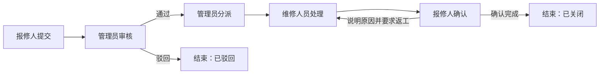

# CampusFix

校园设施报修与工单管理系统。报修人提交问题，调度管理员审核并分派，维修人员记录处理结果，报修人确认或要求返工；工单时间线记录各阶段的操作与责任变化。

> **项目状态：需求设计阶段。** 本仓库目前包含产品需求文档和许可证，尚无可运行应用、安装脚本或演示账户。下文的功能、技术方案与验收流程均为计划，具体实现以合并到仓库的代码和测试结果为准。

本项目是 JC2001 软件工程导论小组项目的 Web 概念验证（PoC），用于展示可追溯的校园设施报修流程，不是学校正式维修服务。紧急安全事故、医疗事件和报警应通过学校现有紧急渠道处理。

## 业务流程

| 角色 | 计划中的主要操作 | 数据范围 |
| --- | --- | --- |
| 报修人（Reporter） | 创建报修、补充说明、查看进度、确认或要求返工 | 自己创建的工单 |
| 维修人员（Technician） | 查看分配任务、开始处理、提交说明与结果照片 | 当前分配给自己的工单 |
| 调度管理员（Admin） | 审核、分类、设定优先级、分派、维护地点、查看统计 | 全部工单及管理数据 |

工单从 `SUBMITTED`（已提交）依次进入 `PENDING_ASSIGNMENT`（待分派）、`ASSIGNED`（已分派）、`IN_PROGRESS`（处理中）、`PENDING_CONFIRMATION`（待确认）和 `CLOSED`（已关闭）。审核时可以驳回；报修人可在审核前撤销。要求返工后，工单回到 `IN_PROGRESS`，并新增返工事件。完整的转换条件、操作者和必填信息见 [PRD：业务规则与状态机](docs/CampusFix_PRD.md#4-业务规则与状态机)。

## 计划范围

**P0：概念验证的交付范围**

- 三类角色登录、退出，以及服务端角色和工单归属授权。
- 受控地点选择、工单创建与查询、图片上传、列表筛选和详情。
- 审核、分派、处理、确认或返工的完整业务闭环。
- 公开留言、事件时间线，以及基于真实工单数据的基础统计。
- 数据库迁移、匿名演示数据、自动化测试、运行交付包和用户手册。

**P1：核心闭环稳定后的候选功能**

站内通知、重新分派、疑似重复报修提示、统计 CSV 导出和满意度评价。课程范围不包括学校统一身份认证、支付采购、复杂排班、实时聊天、原生移动应用或生产级高可用。需求和验收标准详见 [PRD：功能需求与验收标准](docs/CampusFix_PRD.md#5-功能需求与验收标准)。

## 技术方案（待确认）

PRD 建议采用模块化单体：浏览器前端、REST API 后端、关系数据库和私有附件存储。参考技术栈为 React + TypeScript、FastAPI、PostgreSQL，并通过 Docker Compose 组织本地运行。团队尚未确定最终技术栈、依赖版本或目录结构；这里描述的是设计方向，而非已完成的实现。

工程上重点约束如下：

- 状态变更通过具有业务含义的动作接口完成，由服务端验证角色、工单归属及当前状态。
- 工单状态、负责人变更与事件日志在同一数据库事务中提交，并处理并发修改冲突。
- 附件保存在私有存储中，下载经过授权；演示数据不使用真实姓名、学号或报修照片。
- 统计从工单数据计算，测试覆盖正常流程、越权操作、非法状态跳转和异常路径。

模块职责、数据模型及 API 草案见 [PRD：系统架构与模块职责](docs/CampusFix_PRD.md#7-系统架构与模块职责)、[PRD：数据模型](docs/CampusFix_PRD.md#8-数据模型)和 [PRD：API 草案](docs/CampusFix_PRD.md#9-api-草案)。

## 运行与验证

当前仓库尚不能启动或执行自动化测试。代码落地后，维护者应在此补齐经过全新环境验证的步骤，包括：

1. 所需软件及版本、环境变量和依赖安装。
2. 数据库迁移、匿名种子数据与三类演示账户的初始化。
3. 前后端启动、访问地址和完整演示路径。
4. 单元测试、API 集成测试及端到端测试命令。
5. 停止服务与清理演示数据的方法。

目标验收场景是：报修人提交含地点和照片的工单；管理员审核、设定优先级并分派；维修人员提交处理结果；报修人确认或要求返工；时间线与统计随操作更新，且无权用户无法访问或修改该工单。该场景目前是**验收目标，尚未通过测试**。测试分层和最低覆盖要求见 [PRD：测试与验收计划](docs/CampusFix_PRD.md#11-测试与验收计划)。

## 仓库文档

| 文件 | 用途 |
| --- | --- |
| [CampusFix_PRD.md](docs/CampusFix_PRD.md) | 项目目标、需求范围、业务规则、架构草案和验收基线 |
| [LICENSE](LICENSE) | MIT 开源许可证 |

开发时以 PRD 中的 `FR-*` 需求编号和 `UC-*` 用例编号关联设计、接口、测试与结果。若实现范围发生变化，应同步更新 PRD、README 和后续用户手册，避免文档与软件行为不一致。PRD 中仍有场景边界、自助注册、特殊关闭、重新分派及最终技术栈等事项需要团队与导师确认。

## 许可证

本项目采用 [MIT License](LICENSE)。
